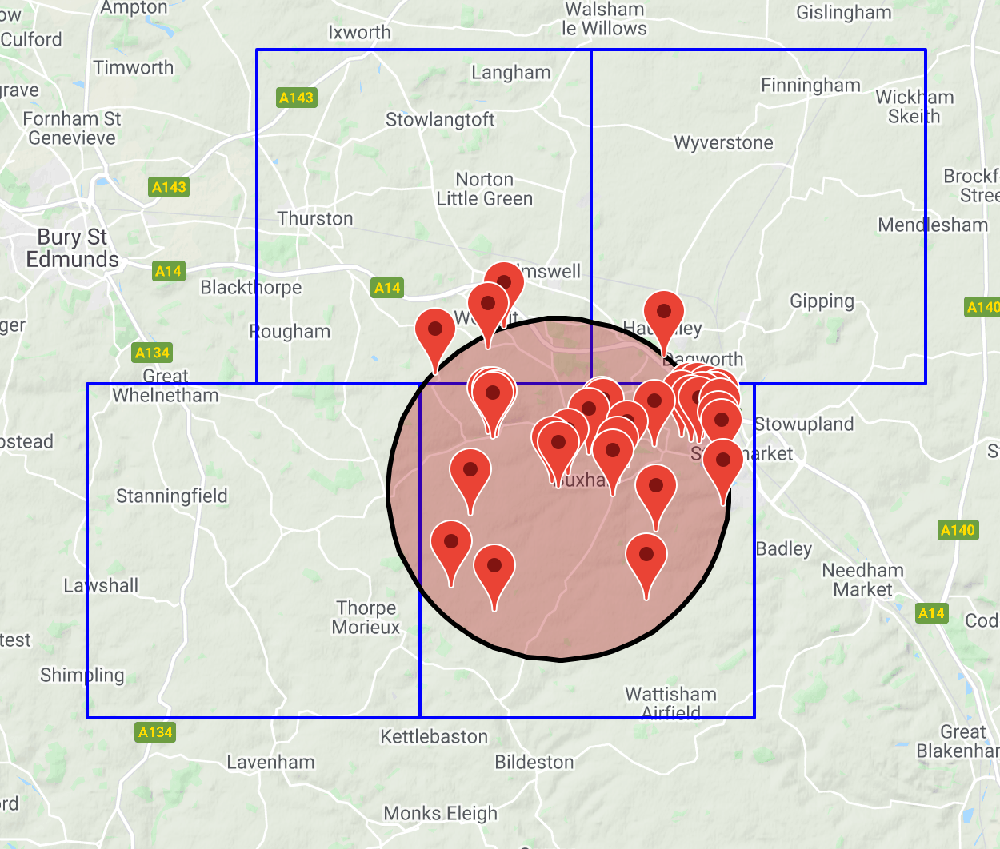

# dhto
DHT overlay

## What?
DHTs are good for doing exact lookups. They aren't so useful for doing more complex queries. dhto allows you to do some of these more complex queries ontop of a standard dht.

## Geospatial

The geospatial index works by first creating a series of global grids over gps space. It gives each grid tile a hash so that it can be uniquely identified on the dht.
Then to index a point, we just find which grid tiles it appears on, and index against that hash.
To do a range lookup, we find the grid tiles that we need, and then throw out anything that is out of range. The selection of the tiles we need can be done in a few ways (We can minimise the number of thrown out results, or we can minimise the number of dht lookups required for example).

## Results

Here, the blue squares are the selected grid tiles for our range query.

 /dht - Interface to dht

 /index_kvp - KVP index overlay

 /index_geospatial - Geospatial index overlay

 /datasources - Test data (eg OSGB)

 /data
	OSGB can be found here https://osdatahub.os.uk/downloads/open/OpenNames

## Test

go test -v .
